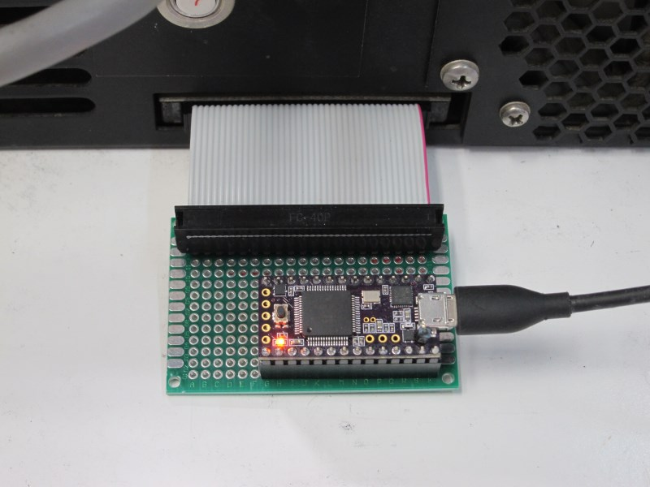
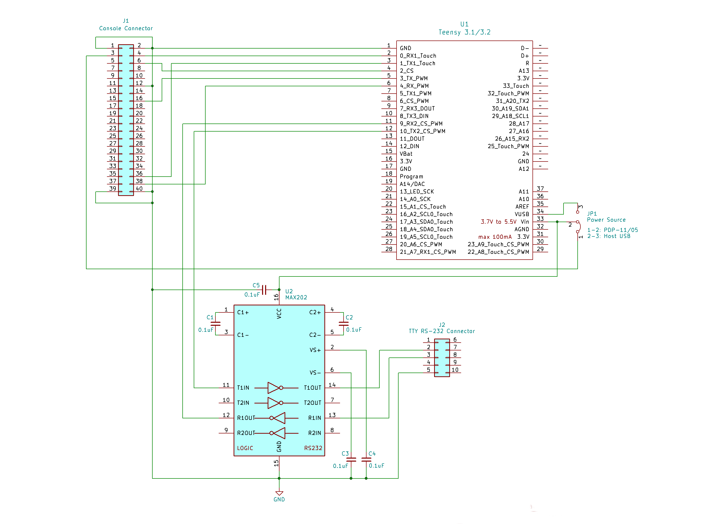
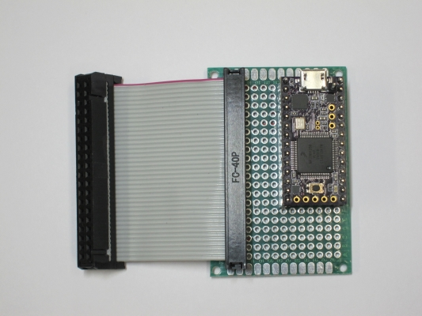
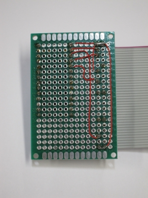

# PDP-11/05 Console USB Adapter

The *PDP-11/05 Console USB Adapter* is a USB-to-serial bridge designed to interface the console of a [PDP-11/05](http://gunkies.org/wiki/PDP-11/05) computer to a modern USB-enabled computer. It also provides an RS-232 compatible serial interface which can be used to connect a real RS-232 terminal. The project is based on the excellent [Teensy 3.1/3.2](https://www.pjrc.com/teensy/teensy31.html) development board from [PJRC](https://www.pjrc.com/), which provides an Arduino-compatible development environment running on a highly-capable ARM Cortex-M processor.

<i><h3>A Special Note to PDP-11/05 Owners</h3></i>

Unfortunately the Teensy 3.1/3.2 development board used in the Console Adapter is no longer in production.  This can make acquiring one difficult or impossible.  However, for those people who own an actual working PDP-11/05, I do have a few Teensy dev boards in my possession that I’m willing to share with fellow enthusiasts.  Please contact me via email to discuss the details on how to get one (jay DOT logue AT gmail DOT com).

## Features

- **Automatic serial port configuration from the USB host**

- **External baud rate generator (allows baud rates higher than 2400)**

- **Adjustable baud rate (1200 to 38400) and serial format (8-N-1, 7-E-1, 7-O-1)**

- **Auxiliary RS-232 TTY interface (for connecting a real serial terminal)**

- **Experimental paper tape reader mode**

## Theory of Operation

The PDP-11/05 Console USB Adapter operates as a simple USB-to-serial bridge.  To the host computer, the Console Adapter appears as a virtual RS-232 interface / COM port.  Software running on the Teensy shuttles characters back and forth between the host interface and a hardware UART connected to the console port of the PDP-11/05 (a.k.a. the SCL or Serial Communication Line).  The Console Adapter operates very similarly to common USB-to-TTL serial devices such as the FTDI FT232R serial cable, except that Console Adapter’s behavior can be fully customized via firmware.

The serial signals exposed by the PDP-11 console port use TTL (0-5V) signaling instead of traditional EIA RS-232 levels (±12 V). Although the Teensy 3.1/3.2 itself is a 3 volt system, its inputs and outputs are 5 volt TTL-compatible, allowing it to be directly interfaced to the older system without level shifting.  _Note that this is not true of all Teensy models, so make substitutions carefully._

The serial input (RX) line on the PDP-11/05 is somewhat curious in that its levels are inverted as compared to a traditional TTL serial line.  Specifically, 0V represents a serial MARK and +5V represents a serial SPACE.  This is accommodated in the Console Adapter by using a special mode of the internal UART that inverts just the TX signal.

### Auxiliary Terminal Interface

In addition to the host USB interface, the Console Adapter provides a second serial interface which can be used to connect a traditional serial terminal, such as a VT-100.   An RS-232 level shifter (MAX202) is used to convert the signals to standard EIA levels, allowing most terminals of the era to be used.  When connected, the terminal functions as an auxiliary console for the PDP-11.  The configuration of the auxiliary terminal interface (baud rate, serial format) automatically tracks that of the PDP11 console interface, ensuring that the two connections are always in sync.

An auxiliary terminal can be used at the same time as the USB host interface, meaning that characters typed on either the host computer or the auxiliary terminal are forwarded to the PDP-11, and characters output by the PDP-11 appear on both the host computer and the auxiliary terminal.

It is also possible to use the Console Adapter with just an auxiliary terminal (i.e. without a host USB connection).  For this to work, the Console Adapter must be configured derive power from the PDP-11 system.  See the Power Source section below for how to do this.

Support for the auxiliary terminal interface is enabled by default, but can be disabled in software via a compile-time option (AUX_TERM_UART_NUM).

### Baud Rate Generation

The PDP-11/05 CPU includes a baud rate generator circuit which generates the 16X clock signal needed to drive the internal console UART chip.  Due to its simplicity, the internal generator is limited to a maximum of 2400 baud.  Conveniently, the generator can be overridden by providing an external clock signal on the console connector, allowing the system to be run up to 40000 baud.  To make it possible to use higher baud rates, the Console Adapter employs a PWM on the Teensy to generate the necessary clock signal to drive the PDP’s UART.  The frequency of this clock signal is automatically adjusted to match the baud rate of the Teensy's UART, ensuring that the two systems are always in sync.  The Console Adapter supports baud rates in the range 1200 to 38400 baud (due to limitations in the Teensy hardware, rates lower that 1200 are not possible).

### Host Selectable Baud Rate / Serial Format

The Console USB Adapter operates as a standard USB serial device.  As such, it is able to process control messages from the host computer requesting changes to the interface baud rate and serial format.  This makes it possible to switch the PDP's serial configuration entirely from software on the host side; for example, from within a terminal program such as minicom, picocom or PuTTY.  

Whenever the Console Adapter receives a serial configuration change message it automatically adjusts the configuration of the console UART and baud rate generator accordingly.  Configuration changes happen on the fly and can be made at any time.  If the auxiliary terminal interface is enabled, the UART for the auxiliary terminal is configured to match the console UART.

By design, the PDP-11/05 CPU is hard-wired to use the 8-N-1 serial format.  However, with appropriate software support on the PDP side, 7-E-1 or 7-O-1 formats can also be used.  Based on this, the Console Adapter limits the serial format to these three formats, and any request to use another format is ignored.

### Power Source

The Console Adapter requires +5V to operate.  By default, the Adapter receives power from the USB connection to the host computer.  This powers both the Teensy processor and the RS-232 level converter for the auxiliary terminal interface.  As an option, it is also possible to power the Console Adapter from the PDP-11 system itself, via the +5V terminal on the SCL connector (pin C/03).  The reason for doing this is to enable the adapter to be used with an auxiliary terminal only—i.e. without a USB connection to a host computer.

There are two changes which must be made to the Console Adapter to use the PDP-11 as a power source:

1. The connection between USB power and the rest of the system must be severed by cutting a trace on the Teensy PCB board.  The Teensy PCB has been specifically designed to allow for this and the process of cutting it is straightforward.  Details on location of the trace and how to cut it can be found here: [Using External Power and USB](https://www.pjrc.com/teensy/external_power.html).  Note that the Teensy uses a multi-layer PCB.  So care must be taken to cut the trace on the outer-most layer only.  Do not press so hard as to damage the traces on the inner layers.

2. The power selection jumper on the Console Adapter (JP1) must be set to the 1-2 position.

Once the Console Adapter has been configured for PDP-11 power, it can be switched back to USB power by switching JP1 back to the 2-3 position.

**IMPORTANT NOTE**: Unless the power trace has been cut (step 1 above), JP1 must **never** be set to positon 1-2, as doing so could damage the host computer and/or the PDP-11.

### Paper Tape Reader Mode

*NOTE: This feature is experimental*

The PDP-11/05 console includes a signal called "READER RUN" which is designed to drive a low-speed paper tape reader such as an [ASR-33](https://en.wikipedia.org/wiki/Teletype_Model_33). When the PDP asserts the "READER RUN" signal, the paper tape reader is expected to read one character from the tape and send it to the computer. In the Console Adapter, this signal is fed to a GPIO pin on the Teensy which uses it to emulate the behavior of a legacy tape reader.

The paper tape reader mode in the Console Adapter is controlled using the virtual RTS signal from the USB host. Under normal circumstances (e.g. when using a terminal program on the USB host) the host asserts the virtual RTS signal over the USB connection to the Console Adapter indicating it has data to send.  When Console Adapter sees this signal, it operates in normal (non-paper tape reader) mode.

If the host *de-asserts* RTS, the Console Adapter switches into paper tape reader mode.  In this mode, characters received from the USB host are buffered in the Console Adapter until the PDP-11 asserts the "READER RUN" signal.  Each time "READER RUN" is asserted, the Console Adapter feeds one character into the hardware UART attached to the PDP and waits for "READER RUN" to be assered again.  Characters flowing the other direction (from the PDP to the USB host) are unaffected.

Technically the PDP-11 has two "READER RUN" lines (+ and -) which are intended to be used in a 20ma current loop circuit.  However, the positive side of the signal ("READER RUN +") is driven with a simple PNP transistor circuit configured as a high-side switch to +5V.  The Teensy reads this by enabling a pull-down resistor on its input pin.  The "READER RUN -" line is ignored entirely. 

### Status LED

The PDP-11/05 Console USB Adapter uses the LED on the Teensy to show status.  The status LED is lit while the system is powered and flashes briefly whenever there is console activity.

## Schematic

The following diagram shows the schematic for the PDP-11/05 Console USB Adapter.

A PDF version of the schematic is available [here](schematic/pdp-1105-console-usb-adapter.pdf).

A KiCad version of the schematic is available [here](schematic/pdp-1105-console-usb-adapter.kicad_sch).

Note that the Console Adapter schematic uses modern pin numbering for the console IDC connector (J1), rather than the archaic DEC letter-based scheme.  For a table showing the relationship between the two numbering schemes, see the following PDF: [pdp-1105-scl-connector.pdf](docs/pdp-1105-scl-connector.pdf).

## Construction

The Console Adapter is simple enough for most people to hand solder on a proto board.  The required parts are:

- 1 [Teensy 3.1/3.2](https://www.pjrc.com/teensy/teensy31.html) development board
- 1 MAX202 Dual RS-232 Line Driver/Receiver
- 5 0.1uF ceramic disc capacitors
- 1 2x20 male IDC header (J1)
- 2 1x14 male pin headers (to be soldered to the Teensy)
- 2 1x14 female pin headers (used as a socket for the Teensy)
- 1 1x3 male pin header (JP1 header)
- 1 0.1" jumper (JP1 jumper)
- 1 16-pin DIP socket, solder tail
- 1 40-pin ribbon cable with 2 female IDC connectors (length as needed)
- Suitable size proto board

### Building and Flashing the Firmware

The firmware for the PDP-11/05 Console USB Adapter is implemented as an Arduino sketch, using the [Teensyduino](https://www.pjrc.com/teensy/teensyduino.html)
add-on software for the Arduino IDE.  To build the firmware, first follow the instructions at the PJRC site 
to install the Arduino IDE with the Teensyduino add-on: [https://www.pjrc.com/teensy/td_download.html](https://www.pjrc.com/teensy/td_download.html)

The firmware can be built and flashed onto the device using the standard Arduino IDE GUI. Alternatively, a gnu compatible Makefile is included for building the firmware from a unix-compatible command line. To build with the Makefile, first set an environment variable pointing to the install location for the Arduino IDE, then run make:

    $ export ARDUINO_PATH=$(HOME)/tools/arduino
    $ make

The 'make flash' command can be used to flash the firmware image onto an attached device.  For this to work, the Teensy Loader command line tool must first be downloaded and built.  The tool can be found here: [https://github.com/PaulStoffregen/teensy_loader_cli](https://github.com/PaulStoffregen/teensy_loader_cli).

To flash the image using the Makefile, first set an environment variable pointing to the teensy\_loader\_cli tool, then
run 'make flash':

    $ export TEENSY_LOADER_CLI=$(HOME)/tools/teensy/teensy_loader_cli/teensy_loader_cli
    $ make flash

## License

The PDP-11/05 Console USB Adapter source code is licensed under the [Apache version 2.0 license](https://www.apache.org/licenses/LICENSE-2.0).

All documentation, including images, schematics and this README, are licensed under a [Creative Commons Attribution 4.0 International License](https://creativecommons.org/licenses/by/4.0/).
