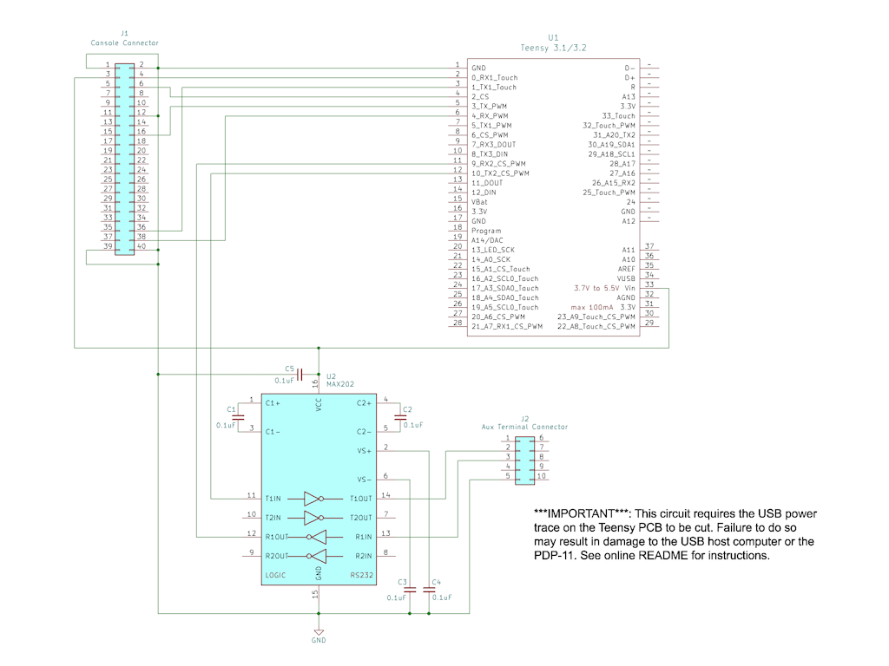

# PDP-11/05 Console USB Adapter

The *PDP-11/05 Console USB Adapter* is a USB-to-TTL serial bridge designed specifically for use with a [PDP-11/05](http://gunkies.org/wiki/PDP-11/05) minicomputer. Its purpose is to connect the console of the PDP-11 to a modern, USB-enabled computer. It also provides an RS-232 compatible serial interface which can be used to connect a real terminal, such as a VT-100. The project is based on the excellent [Teensy 3.1/3.2](https://www.pjrc.com/teensy/teensy31.html) development board from [PJRC](https://www.pjrc.com/), which provides an Arduino-compatible development environment running on a highly-capable ARM Cortex-M processor.

The PDP-11/05 Console USB Adapter provide the following features:

- **Support for direct connection to the SCL connector on the back of the PDP-11/05**

- **Automatic serial port configuration from the USB host**

- **External baud rate generator, allowing baud rates higher than 2400**

- **A range of baud rates (1200 to 38400) and serial formats (8-N-1, 7-E-1, 7-O-1)**

- **Auxiliary RS-232 TTY interface for connecting a real serial terminal**

- **Experimental paper tape reader mode**

<i><h3>A Special Note to PDP-11/05 Owners</h3></i>

Unfortunately the Teensy 3.1/3.2 development board used in the Console Adapter is no longer in production.  This makes acquiring one fairly difficult.  To help with this, I have a few Teensy dev boards in my possession that I’m willing to share with fellow PDP-11/05 owners.  For details on how to receive one, please contact me via email at **jay DOT logue AT gmail DOT com**.

**[Theory of Operation](#theory-of-operation)** 
&nbsp;&nbsp;&nbsp;&nbsp;&nbsp;&nbsp;&nbsp;&nbsp;**[Auxiliary Terminal Interface](#auxiliary-terminal-interface)** 
&nbsp;&nbsp;&nbsp;&nbsp;&nbsp;&nbsp;&nbsp;&nbsp;**[Baud Rate Generation](#baud-rate-generation)** 
&nbsp;&nbsp;&nbsp;&nbsp;&nbsp;&nbsp;&nbsp;&nbsp;**[Host Selectable Baud Rate / Serial Format](#host-selectable-baud-rate--serial-format)** 
&nbsp;&nbsp;&nbsp;&nbsp;&nbsp;&nbsp;&nbsp;&nbsp;**[Status LED](#status-led)** 
&nbsp;&nbsp;&nbsp;&nbsp;&nbsp;&nbsp;&nbsp;&nbsp;**[Power Source](#power-source)** 
&nbsp;&nbsp;&nbsp;&nbsp;&nbsp;&nbsp;&nbsp;&nbsp;**[Paper Tape Reader Mode](#paper-tape-reader-mode)** 
**[Schematic](#schematic)** 
**[Construction](#construction)** 
&nbsp;&nbsp;&nbsp;&nbsp;&nbsp;&nbsp;&nbsp;&nbsp;**[Parts List](#parts-list)** 
&nbsp;&nbsp;&nbsp;&nbsp;&nbsp;&nbsp;&nbsp;&nbsp;**[Assembly](#assembly)** 
&nbsp;&nbsp;&nbsp;&nbsp;&nbsp;&nbsp;&nbsp;&nbsp;**[Modifying the Teensy](#modifying-the-teensy)** 
**[Building and Flashing the Firmware](#building-and-flashing-the-firmware)** 
**[Powering the Console Adapter via USB](#powering-the-console-adapter-via-usb)** 
**[Performing a Loopback Test](#performing-a-loopback-test)** 
**[License](#license)** 

## Theory of Operation

The PDP-11/05 Console USB Adapter operates as a simple USB-to-serial bridge.  To the host computer, the Console Adapter appears as a virtual COM port which can be access by a terminal program.  Software running on the Teensy shuttles characters back and forth between the host COM port and a UART connected to the PDP-11's SCL (Serial Communication Line) port.  The Console Adapter operates very similarly to off-the-shelf USB-to-TTL serial devices such as the FTDI FT232R serial cable, with the exception that Console Adapter’s behavior is fully customizable in software.

The serial signals exposed by the PDP-11 SCL port use TTL (0-5V) signaling instead of traditional EIA RS-232 levels (±12 V). Although the Teensy 3.1/3.2 itself is a 3 volt system, its inputs and outputs are 5 volt TTL-compatible, allowing it to be directly interfaced to the older system without level shifting.  _Note that this is not true of all Teensy models, so make substitutions carefully._

The serial input (RX) line on the PDP-11/05 is somewhat curious in that its levels are inverted as compared to a traditional TTL serial line.  Specifically, 0V represents a serial MARK and +5V represents a serial SPACE.  This is accommodated in the Console Adapter by using a special mode of the Teensy’s UART that inverts just the TX signal.

### Auxiliary Terminal Interface

In addition to the host USB interface, the Console Adapter provides a second serial interface which can be used to connect a traditional serial terminal such as a VT-100.  An RS-232 level shifter (MAX202) is used to convert the signals to standard EIA levels, allowing most terminals of the era to be used.  When connected, the terminal functions as an additional console for the PDP-11.  The configuration of the auxiliary terminal interface (baud rate, serial format) automatically tracks that of the PDP11 console interface, ensuring that the two interfaces remain in sync.

The auxiliary terminal interface can be used at the same time as the USB host interface.  When operated this way, characters typed on either the host computer or the auxiliary terminal are forwarded to the PDP-11, and characters output by the PDP-11 appear simultaneously on both the host computer and the auxiliary terminal. It is also possible to use the Console Adapter with just an auxiliary terminal connected (i.e. without a host USB connection).

Support for the auxiliary terminal interface is enabled in software by default, but can be disabled by setting the compile-time option AUX_TERM_UART_NUM to 0.

### Baud Rate Generation

The PDP-11/05 CPU includes a baud rate generator circuit which generates the 16X clock signal needed to drive the internal console UART chip.  Due to its simplicity, the internal generator is limited to a maximum of 2400 baud.  Conveniently, the generator can be overridden by providing an external clock signal on the console connector, allowing the system to be run up to 40000 baud.  To make it possible to use higher baud rates, the Console Adapter employs a PWM on the Teensy to generate the necessary clock signal to drive the PDP’s UART.  The frequency of this clock signal is automatically adjusted to match the baud rate of the Teensy's UART, ensuring that the two systems are always in sync.  The Console Adapter supports baud rates in the range 1200 to 38400 baud (due to limitations in the Teensy hardware, rates lower that 1200 are not possible).

### Host Selectable Baud Rate / Serial Format

The Console USB Adapter appears to the host computer as a standard USB serial device.  As such, it is able to process special control messages from the host to change the interface baud rate and serial format.  This makes it possible to switch the PDP's serial configuration entirely from software on the host side; for example, from within a terminal program such as minicom, picocom or PuTTY.  

Whenever the Console Adapter receives a serial configuration change message it adjusts the configuration of the console UART and baud rate generator accordingly.  Configuration changes happen on the fly and can be made at any time.  If the auxiliary terminal interface is enabled, the UART for the auxiliary terminal is automatically configured to match the console UART.

By design, the PDP-11/05 CPU is hard-wired to use the 8-N-1 serial format.  However, with appropriate software support on the PDP side, 7-E-1 or 7-O-1 formats can also be used.  Based on this, the Console Adapter limits the available serial format to these three formats, and any request from the host to use another format is ignored.

### Status LED

The PDP-11/05 Console USB Adapter uses the LED on the Teensy to show status.  The status LED is lit while the system is powered and flashes briefly whenever there is console activity.

### Power Source

The Console Adapter operates on +5 volts which it receives from the PDP-11 system via pin 3 in the console connector.  This powers both the Teensy processor and the RS-232 level converter for the auxiliary terminal interface.  Because it gets its power from the PDP, it is possible to use the Console Adapter with only an auxiliary terminal connected, and without a USB connection to a host computer.

Sometimes it is useful to power the Console Adapter when it’s not connected to the PDP-11.  For instructions on how to do this, see the section on [Powering the Console Adapter via USB](#powering-the-console-adapter-via-usb).

### Paper Tape Reader Mode

*NOTE: This feature is experimental*

The PDP-11/05 console includes a signal called "READER RUN" which is designed to drive a low-speed paper tape reader such as an [ASR-33](https://en.wikipedia.org/wiki/Teletype_Model_33). When the PDP asserts the "READER RUN" signal, the paper tape reader is expected to read one character from the tape and send it to the computer. In the Console Adapter, this signal is fed to a GPIO pin on the Teensy which uses it to emulate the behavior of a legacy tape reader.

The paper tape reader mode in the Console Adapter is controlled using the virtual RTS signal from the USB host. Under normal circumstances (e.g. when using a terminal program on the USB host) the host asserts the virtual RTS signal over the USB connection to the Console Adapter indicating it has data to send.  When Console Adapter sees this signal, it operates in normal (non-paper tape reader) mode.

If the host *de-asserts* RTS, the Console Adapter switches into paper tape reader mode.  In this mode, characters received from the USB host are buffered in the Console Adapter until the PDP-11 asserts the "READER RUN" signal.  Each time "READER RUN" is asserted, the Console Adapter feeds one character into the hardware UART attached to the PDP and waits for "READER RUN" to be asserted again.  Characters flowing the other direction (from the PDP to the USB host) are unaffected.

Technically the PDP-11 has two "READER RUN" lines (+ and -) which are intended to be used in a 20ma current loop circuit.  However, the positive side of the signal ("READER RUN +") is driven with a simple PNP transistor circuit configured as a high-side switch to +5V.  The Teensy reads this by enabling a pull-down resistor on its input pin.  The "READER RUN -" line is ignored entirely. 

## Schematic

The following diagram shows the schematic for the PDP-11/05 Console USB Adapter:

A PDF version of the schematic is available [here](schematic/pdp-1105-console-usb-adapter.pdf).

A KiCad version of the schematic is available [here](schematic/pdp-1105-console-usb-adapter.kicad_sch).

Note that the Console Adapter schematic uses modern pin numbering for the console IDC connector (J1), rather than the archaic DEC letter-based scheme.  For a table showing the relationship between the two numbering schemes, see the following PDF: [pdp-1105-scl-connector.pdf](docs/pdp-1105-scl-connector.pdf).

## Construction

### Parts List

- 1 [Teensy 3.1/3.2](https://www.pjrc.com/teensy/teensy31.html) development board
- 1 MAX202 or MAX232A RS-232 Line Driver/Receiver
- 5 0.1uF ceramic disc capacitors
- 1 2x20 male IDC header (J1)
- 1 2x5 make IDC header (J2)
- 2 1x14 male pin headers (to be soldered to the Teensy)
- 1 1x1 male pin header (to be soldered to the Teensy)
- 2 1x14 female pin headers (used as a socket for the Teensy)
- 1 16-pin DIP socket, solder tail
- 1 40-pin ribbon cable with 2 female IDC connectors, length as needed
- Spool of small gauge wire (24-30AWG)
- Suitable size proto board
- 3 female-to-female jumper wires, 3” length or greater (for testing)

### Assembly

The Console Adapter circuit board is simple enough for most people to hand solder using a point-to-point soldering technique (click for larger images):  

To mount the Teensy, two rows of 1x14 male pin headers should be soldered to the bottom of the Teensy PCB:

A single male pin header (1x1) should be soldered to the VUSB pad on the *top* of the Teensy PCB:

### Modifying the Teensy

Because the Console Adapter receives its power from the PDP-11, it is necessary to break the Teensy’s connection to the host’s USB +5V power line in order to avoid creating an electrical connection between the two power sources.  This is accomplished by cutting a PCB trace on the underside of the Teensy.  The Teensy PCB has been specifically designed to allow this modification, and the process of cutting the trace is straightforward.  

**It is essential that this step be performed *before* the Console Adapter is connected to the PDP-11.  Failing to do so could damage the host computer and/or the PDP-11.**

Details on location of the USB power trace and how to cut it can be found on the PJRC site: [Using External Power and USB](https://www.pjrc.com/teensy/external_power.html).

Note that the Teensy uses a multi-layer PCB.  So care must be taken to only cut the trace on the outer-most PCB layer.  **Do not press so hard as to damage the traces on the inner layers.**

### Auxiliary Terminal Cable

The auxiliary terminal connector on the Console Adapter board is designed to work with a straight-through IDC10-to-DB9 serial cable such as the following:

]

This type of cable is commonly referred to as an “AT/Everex” configuration cable, and is readily available from online retailers.

The Console Adapter incorporates a “null modem” configuration into the auxiliary terminal circuit (TX and RX swapped). This allows the auxiliary terminal to be connected using a simple straight-through RS-232 cable (typically a DB9M to DB25M).

## Building and Flashing the Firmware

The firmware for the PDP-11/05 Console USB Adapter is implemented as an Arduino sketch, using the [Teensyduino](https://www.pjrc.com/teensy/teensyduino.html) add-on software for the Arduino IDE.  To build the firmware, first follow the instructions at the PJRC site to install the Arduino IDE with the Teensyduino add-on: https://www.pjrc.com/teensy/td_download.html](https://www.pjrc.com/teensy/td_download.html)

The firmware can be built and flashed onto the device using the standard Arduino IDE GUI. Alternatively, a gnu compatible Makefile is included for building the firmware from a unix-compatible command line. To build with the Makefile, first set an environment variable pointing to the install location for the Arduino IDE, then run make:

    $ export ARDUINO_PATH=$(HOME)/tools/arduino
    $ make

The 'make flash' command can be used to flash the firmware image onto an attached device.  For this to work, the Teensy Loader command line tool must first be downloaded and built.  The tool can be found here: [https://github.com/PaulStoffregen/teensy_loader_cli](https://github.com/PaulStoffregen/teensy_loader_cli).

To flash the image using the Makefile, first set an environment variable pointing to the teensy\_loader\_cli tool, then
run 'make flash':

    $ export TEENSY_LOADER_CLI=$(HOME)/tools/teensy/teensy_loader_cli/teensy_loader_cli
    $ make flash

## Powering the Console Adapter via USB

Sometimes it is necessary to power the Console Adapter while it is disconnected from the PDP-11—for example, when testing the device or flashing new firmware.  This can be accomplished by placing a female-to-female jumper wire between the VUSB pin on the Teensy and pin 3 (+5V) on the console connector.

## Performing a Loopback Test

The Console Adapter firmware supports a loopback test mode that can be used to test the basic functionality of the system.  While in test mode, any characters typed on either the host or auxiliary terminals are echoed back to the user.  Test mode is enabled by grounding a special “test mode” pin on the console connector.  Pin 38 was chosen for this purpose because it is unused by the PDP-11/05.

Loopback test mode requires the Console Adapter to be powered from the host’s USB connection, as described in [Powering the Console Adapter via USB](#powering-the-console-adapter-via-usb).

To place the Console Adapter in loopback test mode, do the following:

- Disconnect the Console Adapter from the PDP-11 and the host computer
- Jumper pin 38 (Test Mode) on the console connector to pin 40 (GND)
- Jumper pin 4 (TX) to pin 36 (RX)
- Jumper the VUSB pin on the Teensy to pin 3 (+5V) on the console connector
- Connect the Console Adapter to the host computer

]

## License

The PDP-11/05 Console USB Adapter source code is licensed under the [Apache version 2.0 license](https://www.apache.org/licenses/LICENSE-2.0).

All documentation, including images, schematics and this README, are licensed under a [Creative Commons Attribution 4.0 International License](https://creativecommons.org/licenses/by/4.0/).
